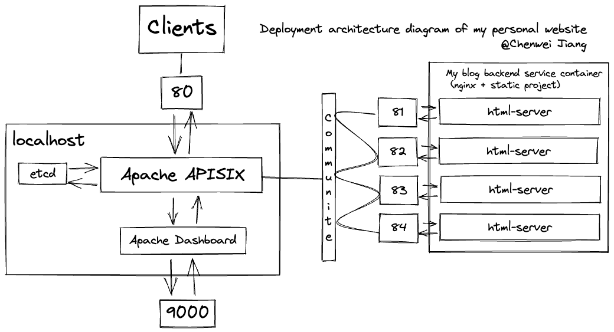
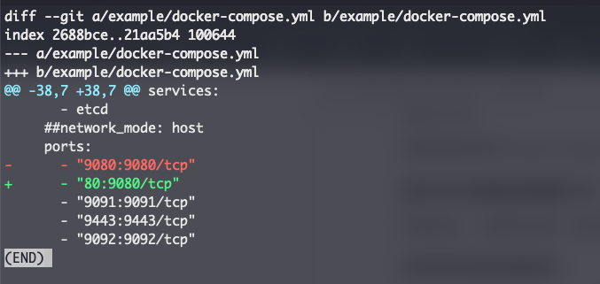
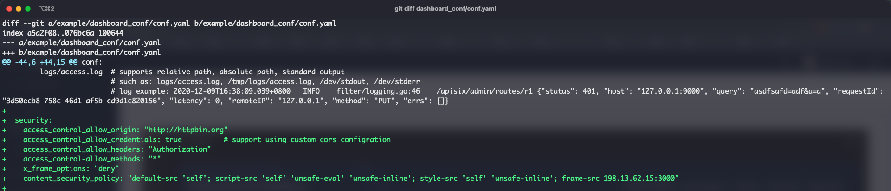

# 江某人的个人网站

[](README-zh.md)  [](README.md)

你可以通过点击这个图标来切换不同语言版本的 README.md 文件。

至于为什么要自称江某人呢？这得从一个高中数学老师说起……

好了好了，咱不扯那么远～回到今天的话题——搭建个人网站。我们从背景讲起叭～

## 背景

熟悉我的人知道，我有过很多个个人网站，其中坚持时间最长的估计就是上一任，用 docusaurus 搭建的网站了（<https://www.cheverjohn.xyz/>）了，整整坚持了六个月有余。我自认为还是很喜欢输出一些文字性的东西的。喜欢将自己所学习的东西分享出去，不断与他人交流，了解一些杂七杂八的东西，不仅限于技术。所以这是我有个人网站的**本心**。

此外，搭建个人网站，我经历了大概这样的技术路线。

| 时间  | 域名    | 技术栈 | 大致作用 |
| ------- | --------- | ------ | -------- |
| 2020.02-2020.06 | mr8god.cn | hexo/travi ci/GitHub action   | 写一些技术文章，理解了 CI 等工具的重要性。 |
| 2020.07 ～ 2021.06 | mr8god.cn | Python / Django / Supervisor / CICD / Vue | 这就是一个非常具有整体性的项目了，我做到了**前后端分离**、**CICD**、**博客社区系统**等很多有意思的事情。 |
| 2021.10 ～ 2022.06 | cheverjohn.xyz | Docusaurus / React /vercel | 这是一个来自于 **meta** 的开源项目 **Docusaurus**，一般开源社区用作文档网站比较多一点，个人拿来做博客我也觉得相当够用了，不过我还是喜欢自己定义格式更多一点，哪怕我每一篇博客的格式都不一样。 |
| 2022.07.17 ～ now | cheverjohn.me | Html / nginx / js / query | 准备大干一场！ |

总之，我对最新的博客寄予厚望，总是需要有人折腾一点的叭～

## 部署方式

### 购买域名

找到一个合适的域名提供商购买即可。这边找的是 namesilo。

然后需要注意的是，我们只需要更改 namesilo 的 nameserver 即可。将其更改为如下：

```yaml
ns1.vultr.com
ns2.vultr.com
```

这两个域名可以在服务器提供商那边获得。

### 购买服务器

找一个靠谱的服务器提供商，获得一个服务器。这边找的是 vultr。

买了服务器之后，需要注意的是，直接使用自带的 DNS 解析服务，构建一下即可。

### 第一种部署方式：NGINX 配置

使用 **NGINX** 作为反向代理服务器，将路由反向代理到 index.html，仅此而已。可以参考这个[链接](https://www.vultr.com/zh/docs/how-to-install-and-configure-nginx-on-a-vultr-cloud-server/#:~:text=Encrypt%20guide%20here.-,Configure%20Nginx%20as%20a%20Reverse%20Proxy,-Nginx%20can%20work)，获取更多的信息。

运行如下命令查看我的配置：

```bash
cat /etc/nginx/conf.d/cheverjohn.me.conf
```

我的 **NGINX** 的配置如下：

```nginx
server {
    listen 80;
    listen [::]:80;

    server_name cheverjohn.me www.cheverjohn.me;

    root /home/vultrchever/website/static;

    index index.html;

    access_log /var/log/nginx/cheverjohn.me.access.log;
    error_log /var/log/nginx/cheverjohn.me.error.log;

    location / {
        try_files $uri $uri/ =404;
    }

}
```

### 第二种部署方式：API 网关部署（简述）

#### 编写个人网站的 Dockerfile

Dockerfile 文件内容如下：

```dockerfile
FROM nginx:alpine
COPY ./static /usr/share/nginx/html
```

#### 将个人网站打包成镜像

打包镜像命令如下：

```bash
docker build -t html-server-image:v1 .
```

然后运行命令如下：

```bash
docker run -d -p 80:80 html-server-image:v1
```

#### 安装 APISIX

直接根据官网的 Docker compose 方式安装即可。

### 绝对可以复现的部署方式（绝对详细）

好啦好啦，上面讲的这些，绝对是不可能让你跟我一样，完全搭建出我的[网站](http://cheverjohn.me/)的。接下来输出干货。

#### 我的网站的整体部署架构



简单用言语介绍一下，这一次我尝试使用了 Apache APISIX 云原生网关来部署我的个人网站。这里边 Apache APISIX、Apache Dashboard、etcd、html-server 都是 Docker 镜像运行的容器。其中 html-server 是我自己自定义创建的镜像容器。其构建的方法可以往上看。

#### 构建后端服务镜像（html-server）

首先 clone 我存放在 GitHub 上的项目。

```bash
git clone git@github.com:Chever-John/SimpleWebsite.git
```

然后进入到仓库里。

```bash
cd SimpleWebsite
```

查看 Dockerfile 文件确认无误。

```bash
cat Dockerfile
<<<!Output>>>
FROM nginx:alpine
COPY ./static /usr/share/nginx/html
```

确认无误后运行镜像构建命令。

```bash
docker build -t html-server-image:v1 .
```

#### 安装 APISIX、APISIX Dashboard

clone 官方提供的 APISIX-Docker 项目。

```bash
git clone git@github.com:apache/apisix-docker.git
```

然后进入到 example 的目录里。

```bash
cd apisix-docker/example
```

由于这边我需要修改 APISIX 这个网关的默认服务端口，从 9080 改到 80，所以我们需要修改一下 docker-compose.yml 文件。

这中间的改动如图所示：



可以看见，只是将原先的 `9080:9080` 改为 `80:9080`，仅此而已。

修改完之后，开始运行容器，运行命令的位置应该是在 Dockerfile 文件所在的目录下，命令如下：

```bash
docker-compose -p docker-apisix up -d
```

#### 配置 Grafana（可选项）

这个需要额外配置，需要修改一下 `apisix-docker/example/dashboard_conf/conf.yaml` 文件。具体修改部分参照下图：



然后 APISIX-Dashboard 就可以正常显示了。

#### 然后配置上游

```json
{
  "nodes": [
    {
      "host": "xxx.xxx.xxx.xxx",
      "port": 81,
      "weight": 1
    },
    {
      "host": "xxx.xxx.xxx.xxx",
      "port": 82,
      "weight": 1
    },
    {
      "host": "xxx.xxx.xxx.xxx",
      "port": 83,
      "weight": 1
    },
    {
      "host": "xxx.xxx.xxx.xxx",
      "port": 84,
      "weight": 1
    }
  ],
  "timeout": {
    "connect": 6,
    "send": 6,
    "read": 6
  },
  "type": "roundrobin",
  "scheme": "http",
  "pass_host": "pass",
  "name": "websiteUpstream",
  "keepalive_pool": {
    "idle_timeout": 60,
    "requests": 1000,
    "size": 320
  }
}
```

#### 配置路由

```json
{
  "uri": "/*",
  "name": "websiteRoute",
  "methods": [
    "GET",
    "POST",
    "PUT",
    "DELETE",
    "PATCH",
    "HEAD",
    "OPTIONS",
    "CONNECT",
    "TRACE"
  ],
  "upstream_id": "418814452935164940",
  "status": 1
}
```

然后一切应该就正常了。

## 版本迭代更新

### docker-compose

如果我更新了网站的内容，比如说我增加了一篇博客，那我们需要进行网站系统的版本迭代更新啊，这里边有很多学问，蓝绿发布啦、金丝雀发布啦、灰度啦，有一说一我对此不精通，纯粹是大概知道有这么些概念，但我网站目前采用的只会是最简单的“停止”到“重启”。

我们可以使用 docker-compose 来进行版本的快速迭代更新。

docker-compose 文件位于该[目录](.docker-compose.yaml)

第一步：首先制定版本，命令如下：

```bash
export TAG=x.x.x
```

第二步：部署，部署命令如下：

```bash
docker-compose -p website up -d --build
```

第三步（可选）：如果已经部署了，需要先停止容器，命令如下：

```bash
docker-compose -p website down
```

然后可以重复第二步了。

## TODO

### 云原生

- [x] Docker 部署：将前端项目打包好，以 Docker 镜像的方式进行部署；
- [ ] 在前置任务完成的基础上，尝试集群部署。

#### API 网关选型

- [x] 探索 API 网关的可行性以及必要性。

### 前端

- [ ] 将博客的 html 样式统一；
- [x] 去~~坑~~坤坤，让坤坤帮俺搞好前端的样式架构。

### 运维

#### CICD

- [ ] 将自动部署搞好，具体需求：我一提交本地代码，我的部署服务器便会自动拉取代码
  - [ ] 进行 CI 工具选型；
  - [ ] 在云端服务器上实现。

#### 灰度发布/金丝雀发布

- [ ] 如小标题，要用 nginx 做好**灰度发布**
